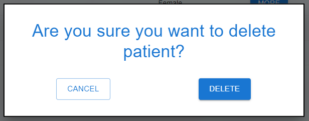

# Aplikacja do zarządzania danymi w laboratorium lub biobanku
Projekt zaliczeniowy z przedmiotu TSWM

Autor: Martyna Borak  
Inżynieria biomedyczna V semestr, Politechnika Śląska

W ramach tego projektu została stworzona aplikacja webowa służąca do zarządzania informacjami o pacjentach i próbkach w laboratorium lub biobanku.
Umożliwia ona przeglądanie, dodawanie, edycję oraz usuwanie danych.

---

## Spis treści
* [O projekcie](#o-projekcie)  
  * [Baza danych](#baza-danych)  
  * [Backend](#backend)  
  * [REST API](#rest-api)  
  * [Frontend](#frontend)  
* [Widoki](#widoki)  
* [Uwagi](#uwagi)
  * [Uruchomienie projektu](#uruchomienie-projektu)

---

## O projekcie
### Baza danych
Projekt wykorzystuje relacyjną bazę danych [MySQL](https://dev.mysql.com/doc/). 
Schemat jest automatycznie tworzony przy pomocy frameworku do mapowania obiektowo-relacyjnego [Hibernate](https://hibernate.org/orm/documentation/6.1/).

### Backend
Backend projektu napisany został w języku [Java](https://docs.oracle.com/en/java/) z wykorzystaniem frameworku [Spring Boot](https://spring.io/projects/spring-boot). 
Jest on podzielony na warstwy: Modelu, Logiki Biznesowej (Serwisową) i Prezentacji (REST API).

### REST API
Backend i frontend porozumiewają się przy pomocy API REST-owego. Backend wystawia 3 główne ścieżki, po 5 endpointów każda:
* /laboratories
  * GET - lista wszystkich laboratoriów
  * GET /{id} - wyszukiwanie laboratorium po ID
  * POST - dodanie nowego laboratorium
  * PUT - edycja istniejącego laboratorium
  * DELETE - usuwanie laboratorium (kaskadowo)
* /patients
  * GET - lista wszystkich pacjentów
  * GET /{id} - wyszukiwanie pacjenta po ID
  * POST - dodanie nowego pacjenta
  * PUT - edycja istniejącego pacjenta
  * DELETE - usuwanie pacjenta (kaskadowo)
* /samples
  * GET - lista wszystkich próbek
  * GET /{id} - wyszukiwanie próbki po ID
  * POST - dodanie nowej próbki
  * PUT - edycja istniejącej próbki
  * DELETE - usuwanie próbki

### Frontend
Frontend aplikacji został napisany w języku [TypeScript](https://www.typescriptlang.org/docs/) z wykorzystaniem frameworku [React](https://reactjs.org/docs/getting-started.html) oraz biblioteki komponentów [Material UI](https://mui.com/material-ui/getting-started/overview/).

---

## Widoki
Strona składa się z czterech głównych widoków: Home, Patients, Samples, Laboratory.
Po naciśnięciu odpowiednich przycisków pojawiają się także formularze pozwalające na dodawanie, edycję i usuwanie pacjentów i próbek.

  
  
  
  

  
  
    

---

## Uwagi
Obecnie aplikacja pokazuje widoki z założeniem, że użytkownik jest już zalogowany do konkretnego laboratorium i widzi powiązane z nim dane. Możliwe jest jednak rozszerzenie jej tak, aby użytkownik mógł zalogować się do dowolnego laboratorium i przeglądać dane z nim powiązane.

### Uruchomienie projektu
Repozytorium zostało podzielone na dwa foldery: biobank-backend i biobank-frontend.

Folder z backendem nie zawiera bazy danych - po uruchomieniu projektu zostanie utworzony nowy pusty schemat. Należy wprowadzić testowe dane samodzielnie (Add Patient > Add Sample).

Folder z frontendem nie zawiera folderu `node-modules` ze względu na jego duży rozmiar. Aby uruchomić projekt należy najpierw wywołać `npm install`, co spowoduje utworzenie tego folderu i dociągnięcie wszystkich niezbędnych zależności zapisane w pliku `package.json`. Następnie można uruchomić projekt za pomocą `npm start`.

W repozytorium znajduje się także nagranie pokazujące działanie aplikacji oraz prezentacja o projekcie.